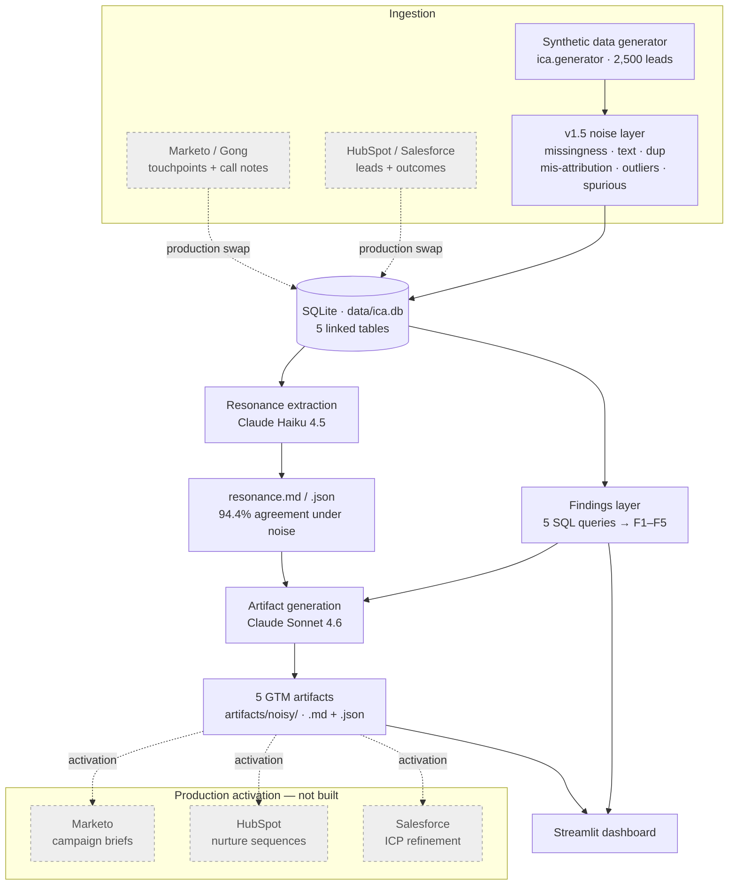

# Inbound Cause Analysis (ICA)

> A root-cause analysis pipeline for inbound GTM — flipped from *"what to fix"* to *"what to amplify."* ICA reconstructs **why** inbound leads convert, then auto-drafts the GTM plays to do more of it — **on a realistic-noisy synthetic dataset, with the LLM resonance layer re-graded under that noise against a pre-committed acceptance gate.**

**Stack:** Python 3.11 · SQLite · Streamlit · Anthropic Claude (Haiku 4.5 + Sonnet 4.6) · 256 tests

---

## Why this exists

For most GTM teams, aside from a one-line 'attribution' CRM field, the inbound lead queue is a black box. As an SDR, some weeks it was full of real ICP buyers; some weeks it was consultants, competitors, or people who would never have budget. I'd work each lead the same way regardless, because aside from the (sometimes) enriched LinkedIn or company URL on the opportunity, nothing told me which leads were which - or, more importantly, why the good ones were showing up in the first place & how we could produce more of them

The reporting on either side of me did not close that gap. I was siloed inbetween Marketing and Account Executives. Marketing reported MQLs at the top of the funnel; sales reported closed-won at the bottom. 

The question in the middle — *which* messages, channels, and journeys actually produced revenue, and which just produced volume — never had an owner, so it never had an answer.

Most GTM teams respond to that gap by optimizing tactics: shuffling the channel mix, A/B testing, and rewriting lead-routing rules. ICA is built on the opposite bet. Tuning tactics in isolation chases noise. I've hypothesized that the higher-leverage move is to reconstruct *why* a lead raised their hand in the first place, cluster those reasons across thousands of leads, and then do deliberately more of what worked.

ICA is a root-cause analysis pipeline for inbound. 

It runs end to end on synthetic data, so the whole project clones and runs in two commands. But every layer above ingestion is source-agnostic — the same pipeline runs on real CRM data with a single adapter swapped, which is the difference between a demo and a system.

## Demo

- **Live dashboard:** [inbound-cause-analysis.streamlit.app](https://inbound-cause-analysis.streamlit.app/) — the four-tab Streamlit app: every finding, a persona × theme explorer, and the generated artifacts.
- **One-page summary:** [`docs/one-pager.pdf`](docs/one-pager.pdf) — the whole story in a 90-second skim.

## What it does

- **Generates a realistic-messy GTM dataset** — 2,500 inbound leads across five linked tables, deterministic from a single seed, then run through a calibrated noise layer that adds missingness, text noise, near-duplicate leads, channel mis-attribution, outlier leads, and three planted false correlations. The default dataset is what a real CRM holds, not a pristine textbook.
- **Surfaces five "aha" findings that survive the noise** — channel-quality surprise, message–persona resonance, a winning multi-touch journey, ICP-fit-versus-volume mismatch, and a secondary compliance-resonance pattern. Each is recovered by plain SQL, guarded by an automated contract test, and re-verified under the noise default. The three planted false patterns sit below the cohort-size floor a respectful finder applies; the pipeline correctly rejects them.
- **Extracts the *why* with an LLM, stress-tested** — Claude reads 2,039 buyer-text snippets (25.5% empty-text fields filtered as missingness) and re-derives the resonance themes independently. Graded against ground truth: **94.4% agreement under default noise** (v1 clean baseline: 94.1%) and **99.2% stable** across three temperature-0 runs (v1: 99.1%) — verified against a pre-committed >80% acceptance gate.
- **Auto-drafts five GTM action artifacts** — a content brief, two sets of ad-copy variants, a sequence play, and an ICP refinement — each grounded in a finding and the buyers' own (noisy) words, emitted as human-readable Markdown *and* tooling-ready JSON.
- **Ships a live dashboard** — a four-tab Streamlit app that renders every finding, a persona × theme explorer, and the artifacts generated from the noisy run.

## How it works

ICA is a five-stage pipeline. Synthetic ingestion produces a SQLite database — passed through a v1.5 noise layer that adds the realistic-messy default; a findings layer runs deterministic SQL over it; an LLM resonance layer extracts themes from the (noisy) free text; an LLM artifact layer drafts the GTM plays; and a Streamlit dashboard renders the result. The diagram below is the whole system — solid nodes are built and runnable, grey dashed nodes are the production wiring.



**Ingestion.** `ica.generator` builds a deterministic synthetic dataset — five linked SQLite tables: `leads` (firmographics, persona, ICP-fit score), `touchpoints` (the full attribution trail), `form_submissions` and `sales_notes` (the qualitative free text), and `outcomes`. 

It covers 2,500 leads over a fixed January–June 2026 window. The dataset is *reverse-engineered*: it is generated so that the five findings are provably present, then the findings are recovered from it independently — the generator and the analysis share no code. A single integer seed drives every random draw through NumPy and Faker, so the same seed reproduces the database byte for byte. The qualitative fields are the point — they carry the buyer's own language, which is what the resonance layer reads.

**Noise layer (v1.5).** Before persistence, the generator output passes through a calibrated noise layer that adds six realistic-CRM impairments at default rates: **25%** missingness on qualitative text fields, **15%** per-token text noise (typos / abbreviations / case mangling), **8%** near-duplicate leads with varied email formats, **12%** channel mis-attribution (40% null, 60% flipped), **1.5%** outlier leads (competitor / internal / spam domains), and **3** planted spurious correlations (small-N, extreme-rate "tempting wrong findings" the pipeline must reject). Six independent RNG sub-streams via `SeedSequence.spawn` so tuning one dimension does not re-roll the others. The pristine v1 dataset is preserved behind `--clean` for the side-by-side comparison the methodology section leans on.

**Findings layer.** Five SQL queries recover the engineered patterns — closed-won rate by channel, by persona × theme, by reconstructed journey path, and bad-outcome share by campaign. These are pure aggregations with no model involved, and an automated contract test (`test_aha_patterns.py`) re-verifies all five **on the noisy default**, so a regression in either the generator or the noise layer cannot silently break a finding.

**Resonance layer (the LLM step).** Claude Haiku 4.5 reads the post-noise free-text snippets and labels each with a primary theme — and an optional secondary — from a fixed nine-theme taxonomy. This is the stage with no equivalent in a tactics-tuning workflow, and the core of the project: it turns unstructured (and intentionally messy) buyer language into structured, queryable signal, and it is held to a measured accuracy bar — re-graded under noise against a pre-committed acceptance gate (see [Methodology](#methodology--the-llm-resonance-layer)).

**Artifact layer.** Claude Sonnet 4.6 takes each finding — its numbers, real buyer quotes from the segment, and the resonance corroboration — and drafts one GTM action artifact. This layer runs offline and once; its output is committed to the repo, so the dashboard never makes a network call and a reviewer sees the artifacts without running anything or holding a key.

**Dashboard.** A four-tab Streamlit app renders the findings, a persona × theme segment explorer, and the generated artifacts. The dashboard reads `artifacts/noisy/` — the v1.5 audience-facing run; `artifacts/` retains the clean-data v1 versions as the methodology reference. The data world and the engineered findings are fully specified in [`docs/data-world.md`](docs/data-world.md) and [`docs/aha-patterns.md`](docs/aha-patterns.md).

## The five findings

The dataset is built to express five findings — it is *reverse-engineered* from them. If the pipeline could not recover all five from the generated data **under default noise**, the dataset or the noise calibration would be re-tuned; they are the contract, and the test suite verifies every one on each run. Headline numbers below are from the v1.5 noisy default (the dashboard's audience-facing view); the v1 clean baseline is shown in parentheses as the reference.

**Finding 1 — the channel-quality surprise.** Podcast-sourced leads close at **31%** under noise (clean: 30%); LinkedIn-paid leads close at **4.4%** (clean: 3%) — a **7× quality gap** (clean: 10×) running directly against volume. A team watching lead counts would double down on LinkedIn; a team watching pipeline quality would protect podcast budget. It is the classic Pareto trap: the channel that *looks* productive is the one quietly burning spend on leads that never close. The action ICA drafts is a content brief to replicate what makes the podcast channel convert — [`F1_content_brief.md`](artifacts/noisy/F1_content_brief.md).

**Finding 2 — message–persona resonance.** A manual-work-reduction message closes mid-market RevOps leaders at **26%** under noise (clean: 25%) against **4.7%** for the identical message shown to every other persona (clean: 2.9%) — a **5.5× lift** (clean: 8.7×). Resonance is a *pairing*. The same words that win one buyer are noise to another, which means message testing that does not segment by persona will average the signal straight out of existence. ICA drafts four ad-copy variants aimed only at the persona that converts — [`F2_ad_copy_variants.md`](artifacts/noisy/F2_ad_copy_variants.md).

**Finding 3 — the winning journey.** Leads who follow a podcast → organic-search → demo-request path within 14 days close at **39%** under noise (clean: 44%) against an **8.2%** dataset-wide rate (clean: 7.1%) — a **4.8× lift** (clean: 6.2×) across a 46-lead cohort (clean: 50). The signal is a *sequence*, recovered by reconstructing each lead's full touchpoint history; a first- or last-touch attribution would credit a single channel and miss the path entirely. F3 is the cohort-size-sensitive finding — the planning header §9.1 flagged it as the finding most at risk of falling below the cohort-size floor under combined duplicate + mis-attribution erosion — it still clears the 30-lead floor with margin. ICA drafts a five-touch sequence play that systematizes the journey deliberately instead of leaving it to chance — [`F3_sequence_play.md`](artifacts/noisy/F3_sequence_play.md).

**Finding 4 — ICP fit versus volume.** The largest LinkedIn campaign (`linkedin_q2_broad_funnel`, **586 leads** under noise) carries an **80% bad-outcome share** (clean: 80%) — disqualified, ghosted, or lost as wrong-fit — with a mean ICP-fit score of **37** against the dataset-wide **53** (both stable across noise). It is the most expensive finding in the set: the campaign generates the most leads and the least pipeline, and raw lead-count reporting actively hides that. ICA drafts an ICP refinement — concrete exclusion and inclusion criteria, plus a checkpoint — to stop the spend bleeding into non-ICP volume: [`F4_icp_refinement.md`](artifacts/noisy/F4_icp_refinement.md).

**Finding 5 — compliance resonance.** Enterprise IT buyers on a compliance/security message close at **21%** under noise (clean: 18%), a **4.1× lift** (clean: 5.0×) over the **5.1%** other personas show on the same message (clean: 3.6%). It is a narrower, lower-volume instance of the Finding 2 pattern — surfaced for completeness and to show the resonance effect is structural, not a one-off — and it, too, gets its own ad-copy artifact: [`F5_ad_copy_variants.md`](artifacts/noisy/F5_ad_copy_variants.md).

## The signature feature — auto-generated GTM artifacts

As an SDR I'd get frustrated with dashboards that only told me what had previously happened. It felt obvious that there should be better communication between marketing, pre-sales, post-sales, and product. This project attempts to close the loop. For each finding, Claude Sonnet 4.6 drafts one GTM action artifact — and because the artifacts are the differentiator, they are built to be *grounded*, rather than generic.

Each artifact is generated from three inputs: the finding's hard numbers (from the noisy default), a set of real buyer quotes pulled verbatim from that segment's free text, and — for the resonance findings — the independent extraction's corroboration of the theme. That grounding shows in the output: the F1 content brief names the "Manual Ops Tax" because buyers in the podcast segment used that exact framing; the F2 ad copy mirrors phrasing lifted from real form answers. An artifact that cannot point back to a number or a quote does not get written.

The five v1.5 artifacts live in [`artifacts/noisy/`](artifacts/noisy/):

- [`F1_content_brief.md`](artifacts/noisy/F1_content_brief.md) — a "Manual Ops Tax" content brief: podcast episode, companion article, and sales one-pager that replicate what makes the podcast channel convert.
- [`F2_ad_copy_variants.md`](artifacts/noisy/F2_ad_copy_variants.md) — four paid ad-copy variants for the mid-market RevOps persona, each mirroring the buyers' own language.
- [`F3_sequence_play.md`](artifacts/noisy/F3_sequence_play.md) — a five-touch, 14-day sequence play that systematizes the winning journey, with enrollment logic and content-gap callouts.
- [`F4_icp_refinement.md`](artifacts/noisy/F4_icp_refinement.md) — exclusion and inclusion criteria, plus a 30-day checkpoint, to tighten the broad-funnel campaign's targeting.
- [`F5_ad_copy_variants.md`](artifacts/noisy/F5_ad_copy_variants.md) — four compliance-angle ad-copy variants for the enterprise IT persona.

Every artifact is emitted twice: as Markdown for a human counterpart to read and edit, and as JSON so a campaign tool can ingest it without re-keying. That dual format is deliberate — the artifact is a draft a GTM team refines *and* a payload a downstream system can route. The dashboard's **Actions** tab renders all five, with the JSON one click away.

**The clean-data v1 artifacts** are preserved at [`artifacts/`](artifacts/) as the reference set the methodology section compares against — same five findings, same prompts, same models, but extracted from pre-noise data. Side-by-side, they are the evidence that the v1.5 noise layer changed the underlying numbers without changing the artifacts' shape, language register, or operational specificity. The dashboard renders the noisy run; the comparison is one directory away.

## Methodology — the LLM resonance layer

The resonance layer is where ICA is most exposed to the usual objection about LLM work — *"you just called an API."* The methodology below is the answer: the extraction is constrained, scored against ground truth on clean data, **then stress-tested against realistic CRM noise with a pre-committed acceptance gate, with the gate firing ACCEPT**. The sections below walk through the evidence in that order.

### Constrained extraction

Claude Haiku 4.5 labels each free-text snippet with a primary theme — and an optional secondary — from a *fixed* nine-theme taxonomy, not open-ended discovery. The extraction prompt is built from the same taxonomy that drives data generation, including a disambiguation rule for the closest theme pairs, so the generator and the extractor apply identical definitions. Output is JSON, parsed and validated against the theme enum.

### Scored against ground truth — v1 clean-data baseline

Every generated snippet carries a ground-truth theme label, so the extraction can be graded directly. On the v1 clean dataset, Claude's extracted primary theme matched the seed label on **94.1%** of snippets (2,574 / 2,736). Across three temperature-0 runs, **99.1%** of snippets received the same primary theme in every run. These are the benchmark numbers the v1.5 stress test compares against.

Per-theme on v1 clean data:

| Theme | Agreement | n |
|---|---:|---:|
| data_quality | 100% | 275 |
| forecasting_accuracy | 100% | 253 |
| tool_sprawl_consolidation | 100% | 243 |
| rep_efficiency | 99% | 345 |
| pipeline_attribution | 97% | 349 |
| manual_work_reduction | 90% | 541 |
| onboarding_ramp | 89% | 213 |
| compliance_security | 88% | 408 |
| cross_team_alignment | 82% | 109 |
| **Overall** | **94.1%** | **2,736** |

### Stress-tested under realistic noise — v1.5

The v1.5 noise layer applies the six dimensions described in *How it works* at calibrated default rates. The extraction is re-run, unchanged in prompt or model, against the noisy dataset.

**Methodology note — empty-text filter.** v1's qualitative fields all carried content; v1.5's missingness dimension blanks ~25% of them to empty strings (the realistic CRM "field exists, nobody filled it in" tail). Empty-text snippets are filtered at load — an analyst reading a real CRM does not ask the LLM to classify a blank field, so neither does the extraction layer here. Filtering at load also keeps the acceptance gate (below) interpretable: the gate fires on signal survival under noise, not on classification-of-garbage. The decision and the rationale live verbatim in commit [`376bd8b`](https://github.com/ryanmichaels-jpg/inbound-cause-analysis/commit/376bd8b).

**Pre-committed acceptance gate.** Before running the stress test, the methodology pre-committed to the following gate on the agreement number — documented in the v1.5 Phase 1 planning header §11, in `src/ica/generator/noise.py`, before any extraction call:

| Agreement | Outcome |
|---|---|
| > 80% | accept; proceed normally — methodology quotes the new number plainly |
| 75–80% | proceed but flag explicitly as honest degradation under noise |
| < 75% | pause and surface — one-shot diagnosis: either re-tune noise OR iterate the prompt v2 → v3, not both, no spiral |

**Result.** Agreement **94.4%** on **2,039 snippets after excluding 25.5% (697 / 2,736) empty-text fields** — verifiably in the **ACCEPT** zone, 14 points above the threshold. Stability **99.2%** across three temperature-0 runs — parity with v1's 99.1%. The gate fires ACCEPT; the diagnosis paths do not activate.

Per-theme on v1.5 noisy data, vs the v1 clean baseline:

| Theme | v1 clean | v1.5 noisy | Δ | v1.5 n |
|---|---:|---:|---:|---:|
| compliance_security | 88% | **90%** | +2 | 308 |
| cross_team_alignment | 82% | **86%** | +4 | 85 |
| data_quality | 100% | 99% | -1 | 210 |
| forecasting_accuracy | 100% | 100% | 0 | 196 |
| manual_work_reduction | 90% | 89% | -1 | 394 |
| onboarding_ramp | 89% | **94%** | +5 | 160 |
| pipeline_attribution | 97% | 94% | -3 | 252 |
| rep_efficiency | 99% | 100% | +1 | 253 |
| tool_sprawl_consolidation | 100% | 100% | 0 | 181 |
| **Overall** | **94.1%** | **94.4%** | **+0.3** | **2,039** |

Cohort sizes drop ~25% per theme (matching the overall missingness rate), uniform across themes. Max single-theme drop: 3 points. Two themes — `onboarding_ramp` and `cross_team_alignment` — improve under noise within run-to-run variance. No theme falls below 86%. The noise layer changes the data; the model's behavior on that data is stable.

### Erosion predictions vs actuals

Two sections of the planning header in `src/ica/generator/noise.py` made explicit named predictions about noise sensitivity. **§9.1** named **F3** (winning journey) as the highest-risk finding under combined duplicate + mis-attribution erosion — specifically that its small cohort might fall below the `FINDING_N_FLOOR=30`. **§2.4** (the mis-attribution dimension's own section) named **F1** as "the most exposed finding" to channel mis-attribution. F2 / F4 / F5 weren't explicitly singled out. The Phase 2 numbers ratify both named predictions — and surface a third finding the planning header *didn't* flag, which is worth keeping visible as honest detail rather than back-fitting it:

| Finding | v1 clean | v1.5 noisy | Δ | Planning prediction |
|---|---:|---:|---:|---|
| F1 channel quality | 10× | 7× | -30% | §2.4: "most exposed — mis-attribution-sensitive" ✓ |
| F2 message–persona | 8.7× | 5.5× | -37% | — (no explicit prediction; **largest absolute erosion** as Phase 2 observation) |
| F3 winning journey | 6.2× | 4.8× | -23% | §9.1: cohort-size sensitive ✓ |
| F3 path cohort N | 50 | 46 | -4 | §9.1: must clear `FINDING_N_FLOOR=30` ✓ (margin +53%) |
| F4 ICP-mismatch share | 80% | 80% | 0 | — (Phase 2 observation: rock-stable) |
| F5 compliance resonance | 5.0× | 4.1× | -18% | — (Phase 2 observation: mild attenuation) |

Two named predictions, both ratified: F1 erodes the predicted way (mis-attribution-driven), F3 erodes the predicted way and clears the cohort floor with margin. The third surprise is **F2** — the planning header did not flag it as sensitive, but it shows the largest absolute erosion of the set at -37%. F2's message–persona resonance depends on text content, which the missingness + text-noise dimensions degrade most directly; in retrospect this is consistent with the noise model, but it was not a written prediction. The methodology earns the honest "and also F2" footnote rather than back-fitting the call.

### Spurious-pattern discrimination

The noise layer plants **three** "tempting wrong findings" — small-N cohorts with extreme close rates, each engineered to surface in a slice a real GTM team would casually look at. The pipeline must NOT surface them as findings. The discrimination test asserts both that each pattern IS findable via its naive aggregation (so the contract isn't vacuous) AND that each cohort sits below the cohort-size floor a respectful finder applies.

| ID | Planted pattern | Surface aggregation | N | Cohort CW |
|---|---|---|---:|---:|
| S1 | Tuesday signups → 80% close | by day-of-week | 5 | 100% |
| S2 | `.ai`-TLD leads → 75% close | by company-domain TLD | 8 | 100% |
| S3 | `'urgent'`-keyword form-text → 90% close | by keyword in free text | 10 | 100% |

`FINDING_N_FLOOR = 30` (in `taxonomy.py`); all three S-cohorts sit below; all five F-finding cohorts (smallest is F3 at 46) sit above. The F1–F5 query set does not aggregate by day-of-week, TLD, or keyword, so the spurious dimensions are not even on the pipeline's radar — and if a future iteration did aggregate that way, the cohort-size floor would discard them anyway. Both lines of defense are documented in `tests/test_noise_discrimination.py`.

### Tolerance — code-only stress test

The acceptance gate above fires on the LLM extraction layer. The generator + findings layer also gets stress-tested, code-only and free of API cost, at higher noise multipliers. Same pre-commit-then-result framing as the LLM-extraction gate:

**Pre-committed contract** (`tests/test_noise_tolerance.py`, in code before the noisy run):

| Multiplier | Minimum F-findings recovered |
|---|---|
| 1.0× (default REALISTIC) | ≥ 5 / 5 |
| 2.0× (STRESS_2X) | ≥ 3 / 5 |
| 4.0× (STRESS_4X) | ≥ 1 / 5 |

**Empirical actuals** (deterministic at seed 42):

| Multiplier | Recovered | Newly dropped |
|---|---|---|
| 1.0× | **5 / 5** — F1 ✓ F2 ✓ F3 ✓ F4 ✓ F5 ✓ | — |
| 2.0× | **4 / 5** — F2 ✓ F3 ✓ F4 ✓ F5 ✓ | F1 (mis-attribution doubled) |
| 4.0× | **3 / 5** — F2 ✓ F4 ✓ F5 ✓ | F3 (cohort squeeze) |

The degradation curve matches the named predictions: F1 (§2.4 mis-attribution prediction) is the first to break at 2×; F3 (§9.1 cohort-size prediction) is the next to break at 4×. F2 / F4 / F5 hold all the way to 4× — they each clear their per-finding floor at every tested multiplier. The contract is "graceful degradation, predictable failure mode" — code-only verification, no additional LLM spend at higher noise.

### The v1 → v2 prompt iteration (preserved from the clean-data round)

Before the v1.5 stress test, the clean-data round itself surfaced a weak spot worth keeping visible. The first extraction came back at 92.3% overall — but `rep_efficiency` sat at just **72%**, far below the rest. Rather than shipping it, a targeted diagnostic re-extracted only the `rep_efficiency` snippets: **100%** of the mis-tags went to a single theme, `manual_work_reduction`. The mis-tagged snippets were rep-productivity statements that named a manual *cause* — *"call quality would be fine if my AEs weren't list-building by hand."* The v1 prompt carried no rule for that pair, so the words "manual" and "by hand" pulled the model the wrong way.

The fix was a disambiguation block applying the taxonomy's existing goal-versus-symptom rule to the `rep_efficiency` / `manual_work_reduction` pair: when a snippet names a selling-capacity goal caused by manual work, the goal is primary and the manual cause is secondary. Re-running full-corpus extraction:

| | v1 | v2 |
|---|---:|---:|
| `rep_efficiency` agreement | 72% | **99%** |
| Overall agreement | 92.3% | **94.1%** |
| Cross-run stability | 98.8% | **99.1%** |
| `manual_work_reduction` agreement | 99% | 90% |

`manual_work_reduction` *gave back* nine points — the expected shape of disambiguating two genuinely adjacent themes. Overall still netted +1.8, so v2 was kept against a pre-agreed rule (`rep_efficiency` ≥ 85% **and** overall not regressed). One iteration, no spiral.

The v1.5 stress test ran against the v2 prompt unchanged. The point of v1.5 was to test whether the prompt that survived clean-data scrutiny also survives realistic-noise scrutiny. It does: 94.1% → 94.4%, parity within run variance.

## Quickstart

```bash
git clone https://github.com/ryanmichaels-jpg/inbound-cause-analysis.git && cd inbound-cause-analysis

make install            # core + dev deps (generator + test suite)
make generate           # build data/ica.db at default REALISTIC noise — deterministic, seed 42
make test               # 256 tests, incl. aha-pattern + noise-discrimination + tolerance contracts

pip install -e ".[dashboard]"
make dashboard           # Streamlit dashboard at localhost:8501
```

The dashboard regenerates `data/ica.db` on first load if it is absent, so it runs on a fresh clone with no extra steps. The default DB is the v1.5 noisy dataset; pass `NOISE=clean` to `make generate` for the v1 pristine reference (`make generate NOISE=clean`).

Regenerating the LLM layer is **optional** — the v1.5 audience-facing artifacts at [`artifacts/noisy/`](artifacts/noisy/) and the v1 clean reference at [`artifacts/`](artifacts/) are both committed, and the dashboard reads `artifacts/noisy/` as-is. To regenerate the noisy default yourself:

```bash
pip install -e ".[insight]"
cp .env.example .env     # set ANTHROPIC_API_KEY
make insight             # extraction ×3 + 5 artifacts → artifacts/noisy/
```

To regenerate the v1 clean-data reference set instead, point both layers at the clean DB and the v1 directory:

```bash
make generate NOISE=clean
python -m ica.insight --out-dir artifacts
```

`make insight` is the only step that calls an external API or needs a key; the generator, the test suite, and the dashboard never do.

## Would this work on real data?

Yes — and I predict the change is narrower than it looks. The synthetic generator is a stand-in for an ingestion connector. In production, HubSpot or Salesforce supplies leads and outcomes, and Marketo or Gong/Attention supplies touchpoints and call notes; a connector lands that data into the same five-table schema ICA already uses, or the warehouse equivalent of it.

Everything above ingestion is source-agnostic by construction. The findings layer is plain SQL against that schema. The resonance extraction and the artifact generation read the same tables and care nothing about where the rows came from. So a connector that populates the schema makes the entire analysis pipeline — findings, extraction, artifacts, dashboard — run on production data unchanged. The synthetic-versus-real boundary is **one ingestion adapter, not a rewrite**.

The v1.5 noise layer makes the "would it work on real data" claim sharper: the pipeline has already been verified against the *kind* of mess production CRMs carry — missingness, mis-attribution, near-duplicates, outliers, and small-N tempting patterns — not just clean engineered data. A real connector would replace the noise layer with the real version of the same impairments; the resonance gate already knows the model can survive them.

On the output side, the artifacts already serialize to JSON, so they are ready to flow back into the systems they describe: campaign briefs into Marketo, nurture sequences into HubSpot, ICP refinements into Salesforce. The grey dashed paths in the architecture diagram are those two adapter layers — ingestion in, activation out — and the pipeline between them is built and running today.

## What this is not

- **Not a production data pipeline.** The generator is synthetic; the production wiring is sketched and argued, not built.
- **Not real-time.** ICA is a batch analysis — it explains a cohort, it does not score leads as they arrive.
- **Not an attribution tool.** It is a cause-analysis and action layer that sits *on top of* CRM and attribution data, not a replacement for it.
- **Not open-ended theme discovery.** Themes are a fixed nine-item taxonomy. That is a deliberate constraint — it makes the extraction gradeable — but it means a genuinely novel theme would not surface on its own.
- **Not exhaustive noise modeling.** Realistic CRM noise modeling is a research field on its own. v1.5 covers six dimensions at calibrated rates with documented rationale; a real production deployment would face additional impairments (regulatory data deletion, entity-resolution drift, identity-graph collisions, tool migrations mid-quarter) that this pass does not model.
- **Not finished campaign copy.** The artifacts are first-draft GTM thinking grounded in data, built to be refined by a human, not shipped verbatim.

## Known limitations & deliberate scope cuts

ICA's specification documents (`docs/data-world.md`, `docs/aha-patterns.md`) were written before the generator; a few intentional gaps between spec and generated data are documented here rather than hidden. v1.5 added a noise layer with its own set of deliberate scope cuts, also documented here.

- **Dataset closed-won rate.** `data-world.md` §5 states a 6% baseline closed-won share; the generated dataset shows **7.1%** clean and **8.2%** under default noise (the +1.1pp bump comes from the three spurious-pattern outcome-flips). The Finding 1 skew lifts per-channel closed-won rates whose volume-weighted average is the figure the Finding 3 lift calculation itself uses. An intentional pre-skew-versus-post-skew distinction.
- **Disqualified / nurture mix.** §5's baseline is 25% disqualified / 35% nurture; the dataset shows ~**29% / ~29%** clean. Finding 4 deliberately rewrites the 600 broad-funnel leads to a disqualify-and-ghost-heavy distribution, which lifts disqualified and lowers nurture dataset-wide.
- **Demographic-field missingness (deferred).** The v1.5 planning header (`src/ica/generator/noise.py` §2.1, preserved in the module docstring) proposed missingness at 25% on qualitative text *and* 7.5% on demographic fields (`company_industry`, `company_employee_count`, `company_revenue_band`). v1.5 ships text-only missingness — demographic missingness would require either DDL nullability on those columns or sentinel values that look broken in the dashboard, both larger scope decisions than v1.5's atomic shape allowed. The deviation is documented in `noise.py`'s IMPLEMENTATION NOTES block (lines 432–443), in `taxonomy.py`'s `NoiseProfile.missingness` field comment, and in commit [`17fac54`](https://github.com/ryanmichaels-jpg/inbound-cause-analysis/commit/17fac54) — Phase 2+ polish item.
- **Empty-text filter at extraction.** Per the methodology note above, the v1.5 missingness dimension blanks ~25% of qualitative fields. The extraction layer skips these at load — `load_snippets()` in `src/ica/insight.py`, introduced in commit [`376bd8b`](https://github.com/ryanmichaels-jpg/inbound-cause-analysis/commit/376bd8b). Every place the agreement number is reported (this README, the resonance.md report, the dashboard's Actions tab) shows the filter rate alongside.
- **Finding 5 comparison cell.** On clean data, the non-Patricia compliance-theme comparison cell lands at **111 leads** — a uniform 6% of the 1,850-lead non-Patricia population. `aha-patterns.md` estimated "~120" against a rounded population; 111 is the precise computation and clears the Finding 5 threshold with margin. Under noise the cell sits at 118 with a 5.1% close rate.
- **Locked CLI knobs.** `python -m ica.cli` supports `--seed`, `--db-path`, `--noise`, `--clean`. `data-world.md` §1 also lists `--total-leads`, `--start-date`, and `--end-date`; these are **locked in v1** — the generator is built for the 2,500-lead, Jan–Jun-2026 world — and passing one produces an explanatory error rather than a silent no-op.
- **The `rep_efficiency` extraction iteration.** v1 extraction scored `rep_efficiency` at 72%; v2 lifted it to 99% with a disambiguation-prompt change, at the cost of a 9-point give-back on `manual_work_reduction`. The v1.5 stress test ran the v2 prompt unchanged. The full journey is documented under [Methodology](#methodology--the-llm-resonance-layer) — it is kept visible on purpose, as the record of how a weak theme was caught and fixed before the noise round.

## What's next

The natural next stage is **closed-loop measurement**: after a team ships the artifacts ICA recommended, track whether those actions actually drove more and better pipeline over the following quarter — closing the loop from *insight* to *action* to *measured impact*. That turns ICA from a one-shot analysis into a learning system, and it is the direct analogue of measuring a fix's impact in a root-cause workflow. Adjacent items that would deepen the v1.5 noise-stress story: demographic-field missingness, an entity-resolution layer for the near-duplicate leads the noise dimension injects, and an LLM-extraction tolerance test at the higher noise multipliers the code-only contract already covers.

## Credits

ICA mirrors the five-stage structure, executive-deliverable framing, and Phase 1 / Phase 2 shape of [jesseautomates/case-study-3](https://github.com/jesseautomates/case-study-3) — a root-cause analysis system for support tickets — but inverts its optimization function from reducing demand to amplifying what works. Built with [Claude Code](https://claude.com/claude-code).
