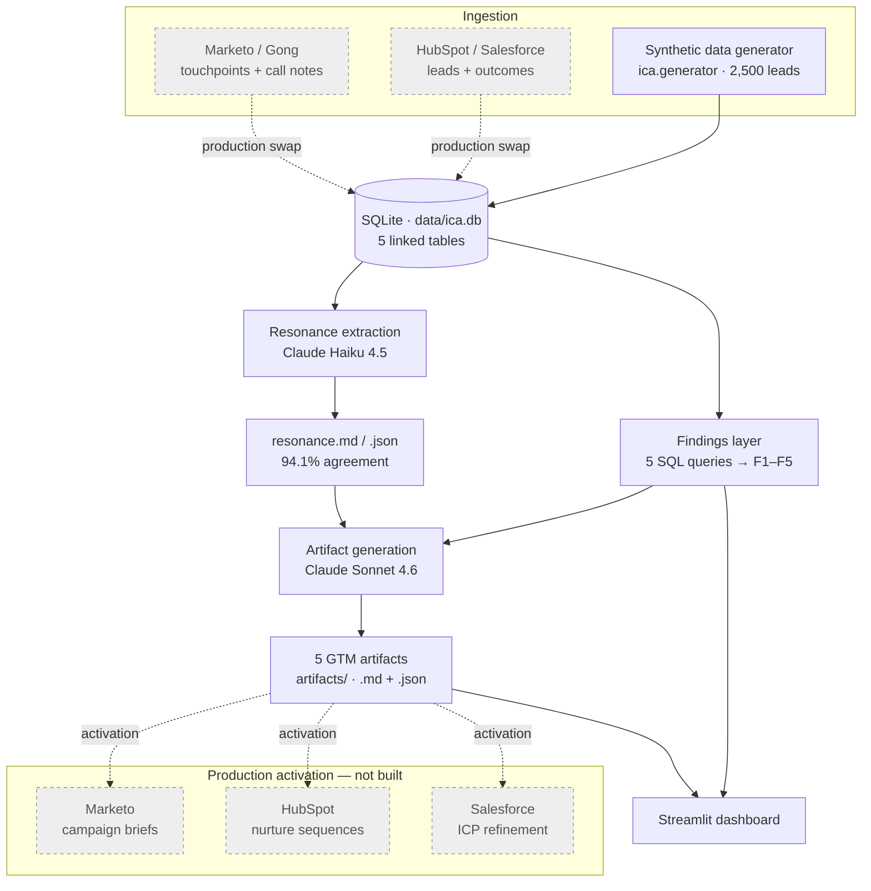

# Inbound Cause Analysis (ICA)

> A root-cause analysis pipeline for inbound GTM — flipped from *"what to fix"* to *"what to amplify."* ICA reconstructs **why** inbound leads convert, then auto-drafts the GTM plays to do more of it.

**Stack:** Python 3.11 · SQLite · Streamlit · Anthropic Claude (Haiku 4.5 + Sonnet 4.6) · 234 tests

---

## Why this exists

For most GTM teams, aside from a one-line 'attribution' CRM field, the inbound lead queue is a black box. As an SDR, some weeks it was full of real ICP buyers; some weeks it was consultants, competitors, or people who would never have budget. I'd work each lead the same way regardless, because aside from the (sometimes) enriched LinkedIn or company URL on the opportunity, nothing told me which leads were which - or, more importantly, why the good ones were showing up in the first place & how we could produce more of them

The reporting on either side of me did not close that gap. I was siloed inbetween Marketing and Account Executives.

Marketing reported MQLs at the top of the funnel; sales reported closed-won at the bottom. 

The question in the middle — *which* messages, channels, and journeys actually produced revenue, and which just produced volume — never had an owner, so it never had an answer. Every quarter the pipeline review asked it, and every quarter was a shrug and a confident-sounding guess.

Most GTM teams respond to that gap by optimizing tactics: shuffling the channel mix, A/B testing, rewriting lead-routing rules. ICA is built on the opposite bet. Tuning tactics in isolation chases noise. I've hypothesized that the higher-leverage move is to reconstruct *why* a lead raised their hand in the first place, cluster those reasons across thousands of leads, and then do deliberately more of exactly what worked.

ICA is a root-cause analysis pipeline for inbound. 

It runs end to end on synthetic data, so the whole project clones and runs in two commands. But every layer above ingestion is source-agnostic — the same pipeline runs on real CRM data with a single adapter swapped, which is the difference between a demo and a system.

## Demo

- **Live dashboard:** [inbound-cause-analysis.streamlit.app](https://inbound-cause-analysis.streamlit.app/) — the four-tab Streamlit app: every finding, a persona × theme explorer, and the generated artifacts.
- **One-page summary:** [`docs/one-pager.pdf`](docs/one-pager.pdf) — the whole story in a 90-second skim.

## What it does

- **Generates a GTM dataset** — 2,500 inbound leads across five linked tables, deterministic from a single seed, carrying the messy qualitative signal real CRMs hold: form free-text, "how did you hear about us," and simulated sales-call notes.
- **Surfaces five "aha" findings** about why inbound converts — a channel-quality surprise, a message–persona resonance differential, a winning multi-touch journey, an ICP-fit-versus-volume mismatch, and a secondary compliance-resonance pattern — each recovered by plain SQL and guarded by an automated test.
- **Extracts the *why* with an LLM** — Claude reads 2,736 raw free-text snippets and re-derives the resonance themes independently, then the extraction is graded against ground truth (94.1% agreement) and across runs (99.1% stable).
- **Auto-drafts five GTM action artifacts** — a content brief, two sets of ad-copy variants, a sequence play, and an ICP refinement — each grounded in a finding and the buyers' own words, emitted as human-readable Markdown *and* tooling-ready JSON.
- **Ships a live dashboard** — a four-tab Streamlit app that renders every finding, a persona × theme explorer, and the generated artifacts.

## How it works

ICA is a five-stage pipeline. Synthetic ingestion produces a SQLite database; a findings layer runs deterministic SQL over it; an LLM resonance layer extracts themes from the free text; an LLM artifact layer drafts the GTM plays; and a Streamlit dashboard renders the result. The diagram below is the whole system — solid nodes are built and runnable, grey dashed nodes are the production wiring.



**Ingestion.** `ica.generator` builds a deterministic synthetic dataset — five linked SQLite tables: `leads` (firmographics, persona, ICP-fit score), `touchpoints` (the full attribution trail), `form_submissions` and `sales_notes` (the qualitative free text), and `outcomes`. 

It covers 2,500 leads over a fixed January–June 2026 window. The dataset is *reverse-engineered*: it is generated so that the five findings are provably present, then the findings are recovered from it independently — the generator and the analysis share no code. A single integer seed drives every random draw through NumPy and Faker, so the same seed reproduces the database byte for byte. The qualitative fields are the point — they carry the buyer's own language, which is what the resonance layer reads.

**Findings layer.** Five SQL queries recover the engineered patterns — closed-won rate by channel, by persona × theme, by reconstructed journey path, and bad-outcome share by campaign. These are pure aggregations with no model involved, and an automated contract test (`test_aha_patterns.py`) re-verifies all five on every run, so a regression in the generator cannot silently break a finding.

**Resonance layer (the LLM step).** Claude Haiku 4.5 reads all 2,736 free-text snippets and labels each with a primary theme — and an optional secondary — from a fixed nine-theme taxonomy. This is the stage with no equivalent in a tactics-tuning workflow, and the core of the project: it turns unstructured buyer language into structured, queryable signal, and it is held to a measured accuracy bar rather than taken on faith (see [Methodology](#methodology--the-llm-resonance-layer)).

**Artifact layer.** Claude Sonnet 4.6 takes each finding — its numbers, real buyer quotes from the segment, and the resonance corroboration — and drafts one GTM action artifact. This layer runs offline and once; its output is committed to the repo, so the dashboard never makes a network call and a reviewer sees the artifacts without running anything or holding a key.

**Dashboard.** A four-tab Streamlit app renders the findings, a persona × theme segment explorer, and the generated artifacts. The data world and the engineered findings are fully specified in [`docs/data-world.md`](docs/data-world.md) and [`docs/aha-patterns.md`](docs/aha-patterns.md).

## The five findings

The dataset is built to express five findings — it is *reverse-engineered* from them. If the pipeline could not recover all five from the generated data, the dataset would be re-seeded; they are the contract, and the test suite verifies every one on each run.

**Finding 1 — the channel-quality surprise.** Podcast-sourced leads close at **30%** (200 leads); LinkedIn-paid leads close at **3%** (1,000 leads) — a 10× quality gap running directly against volume. A team watching lead counts would double down on LinkedIn; a team watching pipeline quality would protect podcast budget at all costs. It is the classic Pareto trap: the channel that *looks* productive is the one quietly burning spend on leads that never close. The action ICA drafts is a content brief to replicate what makes the podcast channel convert — [`F1_content_brief.md`](artifacts/F1_content_brief.md).

**Finding 2 — message–persona resonance.** A manual-work-reduction message closes mid-market RevOps leaders at **25%**, against **2.9%** for the identical message shown to every other persona — an 8.7× lift. The lesson is that resonance is a *pairing*. The same words that win one buyer are noise to another — which means message testing that does not segment by persona will average the signal straight out of existence. ICA drafts four ad-copy variants aimed only at the persona that converts — [`F2_ad_copy_variants.md`](artifacts/F2_ad_copy_variants.md).

**Finding 3 — the winning journey.** Leads who follow a podcast → organic-search → demo-request path within 14 days close at **44%**, against a **7.1%** dataset-wide rate — a 6.2× lift across a 50-lead cohort. The signal is a *sequence*, recovered by reconstructing each lead's full touchpoint history; a first- or last-touch attribution would credit a single channel and miss the path entirely. ICA drafts a six-touch sequence play that systematizes the journey deliberately instead of leaving it to chance — [`F3_sequence_play.md`](artifacts/F3_sequence_play.md).

**Finding 4 — ICP fit versus volume.** The largest LinkedIn campaign (`linkedin_q2_broad_funnel`, 600 leads) carries an **80%** bad-outcome share — disqualified, ghosted, or lost as wrong-fit — and a mean ICP-fit score of **37** against the dataset-wide **53**. It is the most expensive finding in the set: the campaign generates the most leads and the least pipeline, and raw lead-count reporting actively hides that. ICA drafts an ICP refinement — concrete exclusion and inclusion criteria, plus a checkpoint — to stop the spend bleeding into non-ICP volume: [`F4_icp_refinement.md`](artifacts/F4_icp_refinement.md).

**Finding 5 — compliance resonance.** Enterprise IT buyers on a compliance/security message close at **18%**, a 5.0× lift over the **3.6%** other personas show on the same message. It is a narrower, lower-volume instance of the Finding 2 pattern — surfaced for completeness and to show the resonance effect is structural, not a one-off — and it, too, gets its own ad-copy artifact: [`F5_ad_copy_variants.md`](artifacts/F5_ad_copy_variants.md).

## The signature feature — auto-generated GTM artifacts

As an SDR I'd get frustrated with dashboards that only told me what had previously happened. It felt obvious that there should be better communication between marketing, pre-sales, post-sales, and product. This project attempts to close the loop. For each finding, Claude Sonnet 4.6 drafts one GTM action artifact — and because the artifacts are the differentiator, they are built to be *grounded*, rather than generic.

Each artifact is generated from three inputs: the finding's hard numbers, a set of real buyer quotes pulled verbatim from that segment's free text, and — for the resonance findings — the independent extraction's corroboration of the theme. That grounding shows in the output: the F1 content brief names the "Manual Ops Tax" because buyers in the podcast segment used that exact framing; the F2 ad copy mirrors phrasing lifted from real form answers. An artifact that cannot point back to a number or a quote does not get written.

The five artifacts live in [`artifacts/`](artifacts/):

- [`F1_content_brief.md`](artifacts/F1_content_brief.md) — a "Manual Ops Tax" content brief: podcast episode, companion article, and sales one-pager that replicate what makes the podcast channel convert.
- [`F2_ad_copy_variants.md`](artifacts/F2_ad_copy_variants.md) — four paid ad-copy variants for the mid-market RevOps persona, each mirroring the buyers' own language.
- [`F3_sequence_play.md`](artifacts/F3_sequence_play.md) — a six-touch, 14-day sequence play that systematizes the winning journey, with enrollment logic and content-gap callouts.
- [`F4_icp_refinement.md`](artifacts/F4_icp_refinement.md) — exclusion and inclusion criteria, plus a 30-day checkpoint, to tighten the broad-funnel campaign's targeting.
- [`F5_ad_copy_variants.md`](artifacts/F5_ad_copy_variants.md) — four compliance-angle ad-copy variants for the enterprise IT persona.

Every artifact is emitted twice: as Markdown for a human counterpart to read and edit, and as JSON so a campaign tool can ingest it without re-keying. That dual format is deliberate — the artifact is a draft a GTM team refines *and* a payload a downstream system can route. The dashboard's **Actions** tab renders all five, with the JSON one click away.

## Methodology — the LLM resonance layer

The resonance layer is where ICA is most exposed to the usual objection about LLM work — *"you just called an API."* The methodology below is the answer: the extraction is constrained, scored against ground truth, measured for stability, and iterated when a weak spot showed up.

**Constrained extraction.** Claude Haiku 4.5 labels each of the 2,736 free-text snippets with a primary theme — and an optional secondary — from a *fixed* nine-theme taxonomy, not open-ended discovery. The extraction prompt is built from the same taxonomy that drives data generation, including a disambiguation rule for the closest theme pairs, so the generator and the extractor apply identical definitions. Output is JSON, parsed and validated against the theme enum.

**Scored against ground truth.** Every generated snippet carries a ground-truth theme label, so the extraction can be graded directly. Claude's extracted primary theme matched the seed label on **94.1%** of snippets (2,574 / 2,736). Per-theme:

| Theme | Agreement | n |
|---|---:|---:|
| data_quality | 100% | 275 |
| forecasting_accuracy | 100% | 253 |
| tool_sprawl_consolidation | 100% | 243 |
| rep_efficiency | 99% | 345 |
| pipeline_attribution | 97% | 349 |
| manual_work_reduction | 90% | 541 |
| onboarding_ramp | 89% | 213 |
| compliance_security | 88% | 408 |
| cross_team_alignment | 82% | 109 |
| **Overall** | **94.1%** | **2,736** |

**Stability.** The extraction runs three times at temperature 0; **99.1%** of snippets received the same primary theme in all three runs. Stability is reported, not assumed — and a non-deterministic step in a pipeline should be measured.

**The iteration that earned those numbers.** The first extraction run came back at 92.3% overall — but `rep_efficiency` sat at just **72%**, far below the rest. Rather than shipping it, a targeted diagnostic re-extracted only the `rep_efficiency` snippets: **100%** of the mis-tags went to a single theme, `manual_work_reduction`. The mis-tagged snippets were rep-productivity statements that named a manual *cause* — *"call quality would be fine if my AEs weren't list-building by hand."* The v1 prompt carried no rule for that pair, so the words "manual" and "by hand" pulled the model the wrong way.

The fix was a disambiguation block applying the taxonomy's existing goal-versus-symptom rule to the `rep_efficiency` / `manual_work_reduction` pair: when a snippet names a selling-capacity goal caused by manual work, the goal is primary and the manual cause is secondary. Re-running full-corpus extraction:

| | v1 | v2 |
|---|---:|---:|
| `rep_efficiency` agreement | 72% | **99%** |
| Overall agreement | 92.3% | **94.1%** |
| Cross-run stability | 98.8% | **99.1%** |
| `manual_work_reduction` agreement | 99% | 90% |

Note that: `manual_work_reduction` *gave back* nine points. That is the expected shape of disambiguating two genuinely adjacent themes — snippets that read as "a rep problem caused by manual work" now correctly route to `rep_efficiency`, and a few of them were seeded `manual_work_reduction`. Overall still netted +1.8, so v2 was kept against a pre-agreed rule (`rep_efficiency` ≥ 85% **and** overall not regressed). One iteration, no spiral.

That tradeoff propagated cleanly downstream: the per-artifact corroboration figures — the share of a segment's snippets the independent extraction confirms — shifted with it (Finding 2's corroboration moved 100% → 95%, Finding 5's 94% → 91%). The artifacts cite v2 statistics instead of the stale pre-iteration numbers. The consistency from prompt change → per-theme deltas → per-artifact corroboration is the trace that the iteration was real and fully reconciled.

## Quickstart

```bash
git clone https://github.com/ryanmichaels-jpg/inbound-cause-analysis.git && cd inbound-cause-analysis

make install            # core + dev deps (generator + test suite)
make generate           # build data/ica.db — deterministic, seed 42
make test               # 234 tests, incl. the aha-pattern contract

pip install -e ".[dashboard]"
make dashboard           # Streamlit dashboard at localhost:8501
```

The dashboard regenerates `data/ica.db` on first load if it is absent, so it runs on a fresh clone with no extra steps.

Regenerating the LLM layer is **optional** — the artifacts are committed in [`artifacts/`](artifacts/) and the dashboard reads them as-is. To regenerate them yourself you need an Anthropic API key:

```bash
pip install -e ".[insight]"
cp .env.example .env     # set ANTHROPIC_API_KEY
make insight             # extraction ×3 + 5 artifacts → artifacts/
```

`make insight` is the only step that calls an external API or needs a key; the generator, the test suite, and the dashboard never do.

## Would this work on real data?

Yes — and I predict the change is narrower than it looks. The synthetic generator is a stand-in for an ingestion connector. In production, HubSpot or Salesforce supplies leads and outcomes, and Marketo or Gong/Attention supplies touchpoints and call notes; a connector lands that data into the same five-table schema ICA already uses, or the warehouse equivalent of it.

Everything above ingestion is source-agnostic by construction. The findings layer is plain SQL against that schema. The resonance extraction and the artifact generation read the same tables and care nothing about where the rows came from. So a connector that populates the schema makes the entire analysis pipeline — findings, extraction, artifacts, dashboard — run on production data unchanged. The synthetic-versus-real boundary is **one ingestion adapter, not a rewrite**.

On the output side, the artifacts already serialize to JSON, so they are ready to flow back into the systems they describe: campaign briefs into Marketo, nurture sequences into HubSpot, ICP refinements into Salesforce. The grey dashed paths in the architecture diagram are those two adapter layers — ingestion in, activation out — and the pipeline between them is built and running today.

## What this is not

- **Not a production data pipeline.** The generator is synthetic; the production wiring is sketched and argued, not built.
- **Not real-time.** ICA is a batch analysis — it explains a cohort, it does not score leads as they arrive.
- **Not an attribution tool.** It is a cause-analysis and action layer that sits *on top of* CRM and attribution data, not a replacement for it.
- **Not open-ended theme discovery.** Themes are a fixed nine-item taxonomy. That is a deliberate constraint — it makes the extraction gradeable — but it means a genuinely novel theme would not surface on its own.
- **Not finished campaign copy.** The artifacts are first-draft GTM thinking grounded in data, built to be refined by a human, not shipped verbatim.

## v1 limitations & known issues

ICA's specification documents (`docs/data-world.md`, `docs/aha-patterns.md`) were written before the generator; a few intentional gaps between spec and generated data are documented here rather than hidden.

- **Dataset closed-won rate.** `data-world.md` §5 states a 6% baseline closed-won share; the generated dataset shows ~**7.1%**. The Finding 1 skew lifts per-channel closed-won rates whose volume-weighted average is ~7.1% — the figure the Finding 3 lift calculation itself uses. An intentional pre-skew-versus-post-skew distinction.
- **Disqualified / nurture mix.** §5's baseline is 25% disqualified / 35% nurture; the dataset shows ~**29% / ~29%**. Finding 4 deliberately rewrites the 600 broad-funnel leads to a disqualify-and-ghost-heavy distribution, which lifts disqualified and lowers nurture dataset-wide.
- **Finding 5 comparison cell.** The non-Patricia compliance-theme comparison cell lands at **111 leads** — a uniform 6% of the 1,850-lead non-Patricia population. `aha-patterns.md` estimated "~120" against a rounded population; 111 is the precise computation and clears the Finding 5 threshold with margin.
- **Locked CLI knobs.** `python -m ica.cli` supports `--seed` and `--db-path`. `data-world.md` §1 also lists `--total-leads`, `--start-date`, and `--end-date`; these are **locked in v1** — the generator is built for the 2,500-lead, Jan–Jun-2026 world — and passing one produces an explanatory error rather than a silent no-op.
- **The `rep_efficiency` extraction iteration.** v1 extraction scored `rep_efficiency` at 72%; v2 lifted it to 99% with a disambiguation-prompt change, at the cost of a 9-point give-back on `manual_work_reduction`. The full journey is documented under [Methodology](#methodology--the-llm-resonance-layer) — it is kept visible on purpose, as the record of how a weak theme was caught and fixed.

## Phase 2 (sketched, not built)

The natural next stage is **closed-loop measurement**: after a team ships the artifacts ICA recommended, track whether those actions actually drove more and better pipeline over the following quarter — closing the loop from *insight* to *action* to *measured impact*. That turns ICA from a one-shot analysis into a learning system, and it is the direct analogue of measuring a fix's impact in a root-cause workflow.

## Credits

ICA mirrors the five-stage structure, executive-deliverable framing, and Phase 1 / Phase 2 shape of [jesseautomates/case-study-3](https://github.com/jesseautomates/case-study-3) — a root-cause analysis system for support tickets — but inverts its optimization function from reducing demand to amplifying what works. Built with [Claude Code](https://claude.com/claude-code).
